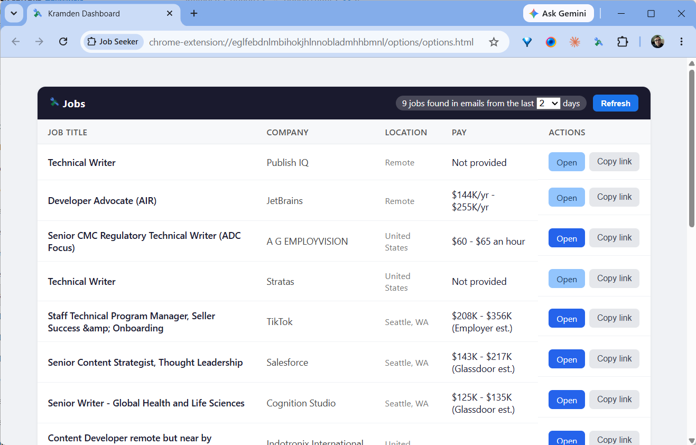
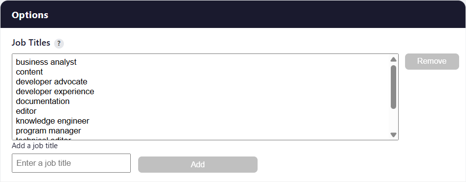

# Job Search Monitor

Job Search Monitor monitors your Gmail inbox for open jobs in real time and filters them by the job titles you're interested in. The current version of Job Search Monitor looks for open jobs in emails from the following job sites:

- Dice
- Glassdoor
- Indeed
- Jobright
- LinkedIn

To install this extension, [visit its page](https://chrome.google.com/webstore/detail/eglfebdnlmbihokjhlnnobladmhhbmnl) on the Chrome Web Store.

## The Interface

**Days:** Specifies how many days back (1–31) to search your inbox. The last selected value is remembered between uses.
**Refresh:** Re-scans your inbox using your current job titles and day range. The first time, Google will ask you to sign in to grant access the extension access to Gmail.

**Sorting:** Click a column header to sort. Click again to reverse the order of selected column. Your last column and sort direction are remembered between uses.

**Open / Copy:** "Open" opens the job posting in a new tab; "Copy link" copies the job posting URL to your clipboard.

**Add Jobs:** To add a job title, enter a title in the provided box and click "Add". Generic job titles return more matches than specific job titles. For example, 'nurse' will return more matches than 'registered nurse'.

# Misc

Read the extension's [privacy policy](privacy-policy).
